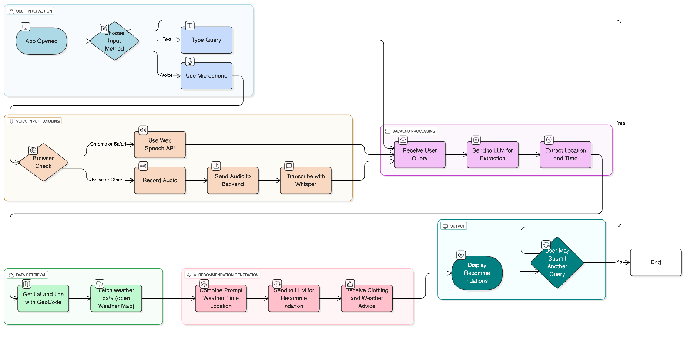

  <h1>Style Planner | スタイルプランナー</h1>
  
AI-powered weather based clothing recommendation app | AI を活用した気象ベースの衣類推奨アプリ

---

## Overview

**Style Planner** is an AI-powered web application that provides real-time weather information and personalized clothing suggestions for any location. Users can interact using voice or text, receive recommendations in English or Japanese. The app is built with Next.js, and leverages AI for natural language understanding and outfit planning.

---

## 概要

**スタイルプランナー** は、AI を活用してリアルタイムの天気情報と、場所に応じた服装の提案を行うウェブアプリケーションです。ユーザーは音声またはテキストで操作でき、英語または日本語で提案を受け取ることができます。Next.js で構築され、自然言語理解とコーディネート提案に AI を活用しています。

---

## Features

- 🌦️ **Weather Forecasts:** Get current and future weather for any city or landmark worldwide.
- 🧥 **Clothing Recommendations:** Receive AI-generated outfit suggestions tailored to the weather.
- 🗣️ **Voice & Text Input:** Ask about your locations weather using your voice or keyboard.
- 🗺️ **Map Preview:** Visualize locations and weather on an interactive map.
- 🌐 **Multilingual:** Supports English and Japanese, with easy language switching.
- 🏙️ **Major Cities Quick View:** Instantly check weather for major Japanese cities.

---

## 特徴

- 🌦️ **天気予報:** 世界中の都市やランドマークの現在および未来の天気を取得可能
- 🧥 **服装提案:** 天候に合わせた AI 生成のコーディネート提案を提供
- 🗣️ **音声 & テキスト入力:** 音声やキーボードで天気を問い合わせ可能
- 🗺️ **地図プレビュー:** インタラクティブな地図で場所と天気を可視化
- 🌐 **多言語対応:** 英語と日本語をサポートし、簡単に切り替え可能
- 🏙️ **主要都市クイックビュー:** 日本の主要都市の天気をすぐに確認可能

---

## Architecture

---

## Tech Stack

### Disclaimer: Live voice input works on Google Chrome or Safari and transcript voice on other browsers.

### 免責事項: ライブ音声入力は Google Chrome または Safari で機能し、トランスクリプト音声は他のブラウザで機能します。

---

## Tech Stack

- **Framework:** Next.js
- **Styling:** Tailwind CSS, Geist UI, shadcn/ui
- **AI & NLP:** Groq-sdk, llama, Whisper
- **Maps:** Leaflet, React-Leaflet, Geocode, OpenWeatherMaps
- **Icons:** Lucide, Radix UI
- **State & Context:** React Context API
- **TypeScript** for type safety
